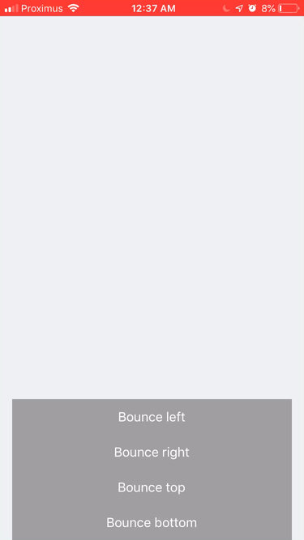

# Bounce



<div>
  
  
  <a href="https://www.notion.so/thibmaek/16e4db66f4cd442fb432b6fc1dcd77e1?v=863ff57229564aa483a4947095a8e04b"></a>
</div>
<div>
  <a href="https://snack.expo.io/@thibmaek/rnbounce"></a>
</div>

Simple animation wrapper component to bounce animate a view on the screen. Uses RN's accelerated Animation API.

**Features:**

- Just wrap your component and give it a direction
- Respects reduced motion preference to skip or show the animation

## Usage

```jsx
import { Alert } from '../../../components/organisms/';

const MyView = () => (
  <View>
    <Bounce bounceInFrom="right">
      <Alert title="Something happened" />
    </Bounce>
  </View>
)
```

This example will animate the Alert component in from the righthand side.

### Signature

```typescript
interface Props {
    /* Component tree which gets animated with the Bounce component */
    children?: ReactNode,

    /* Direction to bounce in from, default left */
    bounceInFrom?: 'bottom' | 'left' | 'right' | 'top',

    /* Should the rendered view appear at top z level */
    topLevel?: boolean,
}
```
