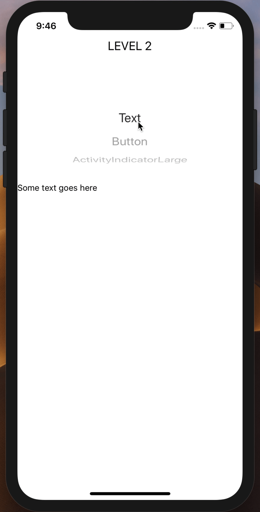

# PlaygroundWrapper



Storybook-like wrapper component to render a collection of components quickly from an import all
Useful if you apply [Atomic design](bradfrost.com/blog/post/atomic-web-design/) or some derived version of it.

Like Storybook, but without the setup and built with zero dependencies.

**Features:**

- Shows a picker to pick a component you want to view
- Pass down props to the component so you can still tweak it
- Adjustable styles

## Usage

```jsx
import * as Atoms from '../../../components/atoms/';

const AtomsPlayground = () => <PlaygroundWrapper components={Comps} title="Atoms"/>
```

Note that when doing an import all, and your component's exported key does not start with an uppercase letter, that it is ignored.
This is to avoid including utility modules or other non-react components in the picker's list.

## Passing down 'state' as props to the components

If you want to further tweak the current component in your playground screen you can us the `componentState` prop to pass it down.

The keys in this object must have the same name as your component!

```jsx
// atoms/Button.js
export default props => <Button title={props.title} onPress={props.onPress} />

// atoms/index.js
export { default as Button } from './Button.js';

// screens/AtomsPlayground.js
import * as Atoms from '../atoms';

const AtomsPlayground = () => <PlaygroundWrapper
  components={Comps}
  componentState={{
    Button: {
      title: "Overwrite",
      onPress: () => alert('Button pressed')
    }
  }}
  title="Atoms"
/>
```

## Signature

```typescript
type TProps = {
  /* Style to pass to the underlying View that wraps your current component */
  componentContainerStyle?: Object,
  /* A collection of components to pass from an import all */
  components: string[],
  /*
    Component state to pass down via props
    The key must have the same value as your component name.
    So with a component ListItem passed:
  */
  componentState?: Object,
  /* Style to pass to the underlying ScrollView */
  contentContainerStyle?: Object,
  /* Specific component to exclude from the passed components */
  exclude?: string,
  /* Title which appears above the Picker component */
  title?: string,
  /* Style to pass to the title Text view */
  titleStyle?: Object
};
```
